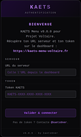
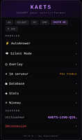
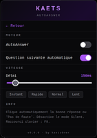
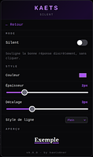
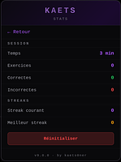

# KAETS-Menu-Voltaire
Comme vous le savez Projet Voltaire peut être un véritable problème. Son utilisation obligatoire dans certains établissements scolaires ou professionnels, vous angoisse ? Le menu [KAETS] est désormais accessible et open-source. Suivez le guide d'installation pour son utilisation. Demande de mise à jour à : token-voltaire-menu@etik.com 💗💗💗💗
<div align="center">


<br />


<br />

</div>


---

## # Aperçu

<div align="center">





</div>
<br />

## # Fonctionnalités

|      | Options           | Description                                              |
| :--: | ---------------- | -------------------------------------------------------- |
|  ⚡  | **AutoAnswer**   | Clique automatiquement la bonne réponse                  |
|  👁  | **Silent Mode**  | Souligne discrètement la bonne réponse, sans cliquer     |
|  ◫   | **Overlay**      | Affiche la réponse en direct à l'écran                   |
|  🔍  | **Compare**      | Recherche la question dans la base locale                |
|  ▦   | **Database**     | Dump complet des exercices en cache local                |
|  ≡   | **Niveau**       | Méta du niveau courant (titre, règles, exercices)        |

<br />

**Raccourcis clavier**

|              Touche              | Action                          |
| :------------------------------: | ------------------------------- |
| <kbd>Insert</kbd> · <kbd>*</kbd> | Ouvrir / fermer le menu         |
|          <kbd>F9</kbd>           | Activer / désactiver AutoAnswer |


<br>

## # Installation

1- Pour faire fonctionner le menu il est **nécessaire d'installer docker**, sans ça, le backend (code côté serveur) ne fonctionnera pas. Vous pouvez suivre la documentation officielle de Docker :
> <div align="center"><a href="https://docs.docker.com/engine/install/">Linux</a> | <a href="https://docs.docker.com/desktop/setup/install/windows-install/">Windows</a> | <a href="https://docs.docker.com/desktop/setup/install/mac-install/">macOS</a></div>
<br>

2- Une fois Docker installé, téléchargez l'extension Tampermonkey sur votre navigateur. Tampermonkey permet d'exécuter en temps réel du code JavaScript. Grâce à elle, vous pouvez ouvrir le menu :
> <div align="center"><a href="https://chromewebstore.google.com/detail/tampermonkey/dhdgffkkebhmkfjojejmpbldmpobfkfo?hl=fr&pli=1">Chrome</a> | <a href="https://addons.mozilla.org/fr/firefox/addon/tampermonkey/">Firefox</a> | <a href="https://www.tampermonkey.net/index.php?browser=safari&locale=en">Safari</a> | <a href="https://microsoftedge.microsoft.com/addons/detail/tampermonkey/iikmkjmpaadaobahmlepeloendndfphd">Edge</a></div>
<br>

3- Ensuite, installez le repo GitHub. Plusieurs façons :
<br>

A- Tout en une commande (Linux / macOS 🐧🍎)
```bash
git clone https://github.com/gGaToRr/KAETS-Menu-Voltaire.git

cd KAETS-Menu-Voltaire/backend && docker compose up --build
```
B- Deuxième manière, télécharger l'archive (.zip) :
<div align="center">
<button style="background-color: green;border-radius: 8px; border:none; width: 200px; height:30px; color: white; font-size: large; font-weight: bold;background: linear-gradient(90deg,rgba(112, 42, 155, 1) 0%, rgba(87, 175, 199, 1) 50%, rgba(83, 206, 237, 1) 100%);">DOWNLOAD</button>
</div>
<br>

Une fois le `.zip` récupéré, suivez ces 4 petites étapes :

**a)** Décompressez l'archive
> **Windows** : clic droit sur le `.zip` → *Extraire tout...* → choisir un dossier (ex: Bureau)

> **macOS** : double-clic sur le `.zip` → le dossier se crée tout seul à côté

<br>

**b)** Démarrez Docker Desktop et attendez que la baleine en bas à gauche soit **verte**. Si elle est rouge ou jaune, Docker n'est pas prêt — patientez quelques secondes.

<br>

**c)** Ouvrez un terminal **directement dans le dossier `backend/`** du projet :
> **Windows** : ouvrez le dossier `KAETS-Menu-Voltaire-main/backend/`, puis <kbd>Shift</kbd> + clic droit dans un endroit vide → *Ouvrir PowerShell ici*

> **macOS** : clic droit sur le dossier `backend/` → *Nouveau terminal au dossier*

<br>

**d)** Collez la commande suivante et appuyez sur <kbd>Entrée</kbd> :
```bash
docker compose up --build
```

Patientez ~1 minute le temps que Docker télécharge les dépendances. Quand vous voyez le message `Application startup complete`, le backend est prêt ! ✅


> <div align="center">Vérification : <a href="http://localhost:8000/health">http://localhost:8000/health</a></div>
<br>

Pour finir, ouvrez le tableau de bord Tampermonkey, créez un nouveau script et collez tout le contenu de `pj-9.1.js` dedans. Sauvegardez avec `Ctrl + S`, puis rendez-vous sur Projet Voltaire ! La touche <kbd>Insert</kbd> ouvre le menu.
<br />


## # État du projet

Le projet est **fonctionnel** et **maintenu**. Toutes les fonctionnalités du menu marchent localement, aucun serveur externe n'est requis : tout tourne en Docker sur votre machine.

Vous pouvez ouvrir une *issue* sur GitHub pour signaler un bug ou proposer une amélioration ! Pour les demandes urgentes : token-voltaire-menu@etik.com 💗💗💗💗

<br />

## # FAQ

<details>
<summary><b>Le menu ne s'ouvre pas avec Insert, que faire ?</b></summary>

> Assurez-vous que Tampermonkey est bien activé sur la page Projet Voltaire et que le script `pj-9.1.js` apparaît dans la liste des scripts actifs. Essayez aussi avec la touche <kbd>*</kbd>.
</details>

<details>
<summary><b>Le backend ne répond pas (offline dans Database)</b></summary>

> Vérifiez que le conteneur Docker tourne bien avec `docker ps`. Si non, relancez avec `docker compose up -d` depuis `backend/`. Le port `8000` doit être libre sur votre machine.
</details>

<details>
<summary><b>Comment réinitialiser le popup de bienvenue ?</b></summary>

> Ouvrez les outils de développement (F12) → Application → Local Storage → supprimez la clé `kaets_v9_popup_shown`.
</details>

<br />

## # Licence

MIT

<br />

<div align="center">

<sub>— kaets0ner —</sub>

<p style="color:#22c55e; font-family: monospace; white-space: pre; text-align: center;">
 _  __          _        ___             ____  
| |/ /__ _  ___| |_ ___ / _ \ _ __   ___|  _ \ 
| ' // _` |/ _ \ __/ __| | | | '_ \ / _ \ |_) |
| . \ (_| |  __/ |_\__ \ |_| | | | |  __/  _ < 
|_|\_\__,_|\___|\__|___/\___/|_| |_|\___|_| \_\
</p>

</div>
